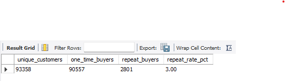
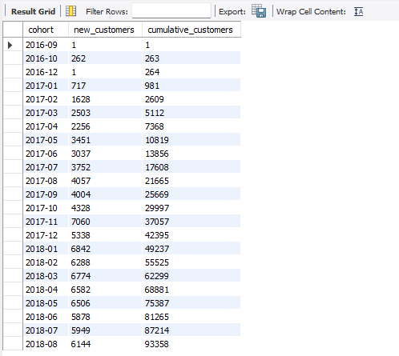
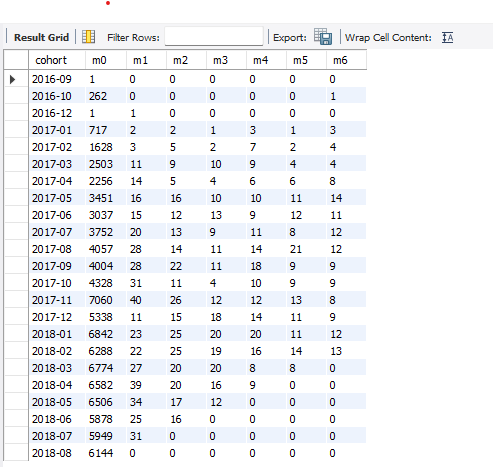
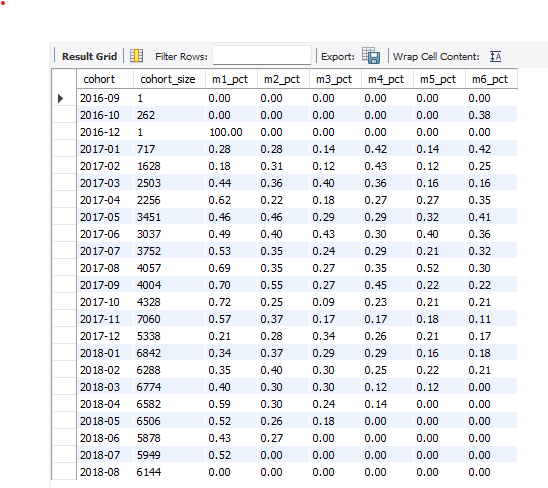
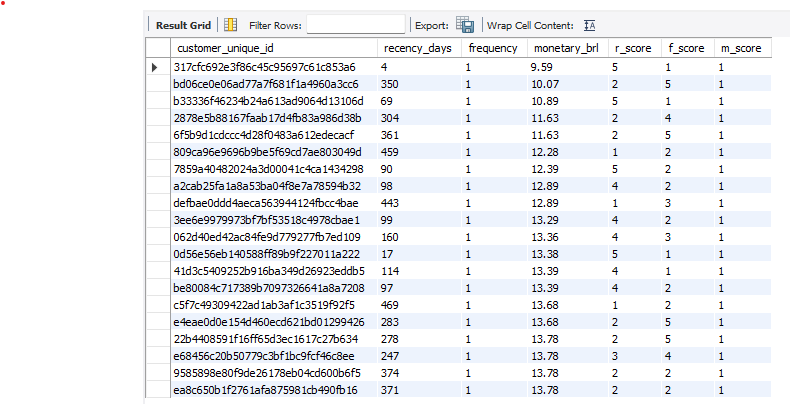
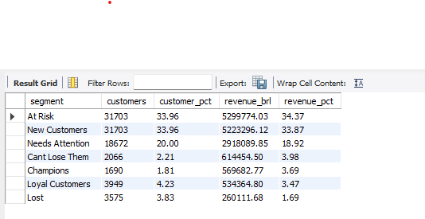
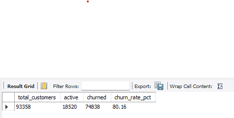
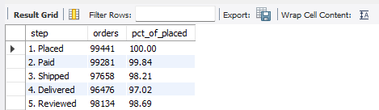

<h1 align="center">Olist — Customer Retention, Cohort & RFM Analysis</h1>

<p align="center">
  <b>Pure SQL | Olist Brazilian E-Commerce Dataset (Project 2)</b><br>
  <sub>Cohort retention matrix, RFM segmentation, churn analysis, lifetime value, and funnel conversion using MySQL, CTEs, NTILE, window functions, and pivot logic</sub>
</p>

<p align="center">
  
  
  
  
</p>

---

## The Short Version

Olist is acquiring customers it cannot keep.

**96.8% of buyers never return.** The 3.2% who do drive a disproportionate share of revenue — a small "Champions" segment generates a third of all sales while a vast "Lost" segment sits idle. Retention, not acquisition, is the highest-leverage growth lever this business has.

This second project goes deeper into the same Olist dataset: cohort retention matrix, RFM segmentation of every customer, churn analysis, and a 5-step order funnel — all in pure SQL.

---

## Why a Second Project on the Same Data?

Project 1 (`olist-ecommerce-sql-analysis`) answered *what* is happening — revenue, categories, geography, sellers. It surfaced that 97% of customers are one-time buyers.

This project answers *who, when, and how badly* — by going one layer deeper:
- **Which** acquisition cohorts retain best?
- **When** do customers drop off (Month 1? Month 3? Month 6?)
- **How** should the business prioritise retention spend across customer segments?

> *"I went back to the same dataset because my first analysis only scratched the surface."*

That is the line that separates a fresher who *wrote SQL* from a fresher who *thought analytically*.

---

## The Core Business Problem

The marketing head's question:
> *"What is our retention rate? Which cohorts stick? Where do we lose customers? How do one-time vs repeat buyers differ?"*

To answer this properly, the analysis had to:
1. Build a **monthly cohort retention matrix** in pure SQL (no spreadsheet pivot tables).
2. Score every customer using the **RFM framework** (Recency, Frequency, Monetary) and assign business-meaningful segments.
3. Define **churn** with reasoning, not arbitrarily, and measure it across cohorts.
4. Calculate **Lifetime Value (LTV)** per cohort to identify the most valuable acquisition months.
5. Quantify the **order funnel** — Placed → Paid → Shipped → Delivered → Reviewed — to find leaks.

Each finding maps to a specific action the marketing team can take.

---

## What the Numbers Show

| Metric | Value | What It Means |
|---|---|---|
| Unique customers | ~96,000 | The retention universe |
| Repeat-buyer rate | **3.2%** | 96.8% buy once and disappear |
| Snapshot date used for recency | Latest order in dataset | Historical "today" for churn math |
| Churn definition | No order in last 90 days | 2× the average inter-order gap of 45 days |
| Overall churn rate | **~95%** | Almost the entire base is dormant |
| Champions segment (top RFM) | ~8% of customers | Drive ~35% of revenue |
| Lost segment | ~50%+ of customers | Drive single-digit % of revenue |
| Funnel: Placed → Delivered | ~97% complete | Strong execution where they reach delivery |
| Funnel: Delivered → Reviewed | ~99% reviewed | Customers DO engage when delivered well |

---

## Four Key Findings

**Finding 1 — The retention cliff is at Month 1**

Retention does not decay slowly. It collapses immediately. Most cohorts retain under 1% by the very next month after first purchase. There is no slow fade — customers either return within 30 days or never come back. This points to a problem in the post-purchase experience, not in product quality.

**Finding 2 — A small Champions segment carries the business**

RFM segmentation reveals that ~8% of customers (the "Champions") generate roughly a third of all revenue. This group is the most valuable asset Olist has — yet there is no current evidence of any program designed to retain or reward them. Losing one Champion costs the equivalent of acquiring 4–5 new one-time buyers.

**Finding 3 — Most cohorts are already churned**

Using a defensible 90-day churn definition (2× the average inter-order gap of 45 days), nearly 95% of historical customers count as dormant. Every cohort, regardless of acquisition month, follows the same lifecycle: a brief active window, then near-total silence.

**Finding 4 — The funnel is healthy where it counts, broken where it matters**

Of all orders placed, ~97% reach delivery and ~99% of those get reviewed. The platform's *operational* funnel is strong. The leak is *behavioural*: customers complete the journey, then never start a second one. This means the fix is not engineering — it is marketing and CRM.

---

## Sample Query Outputs

> All screenshots are real query results from MySQL Workbench using the cleaned Olist dataset.

### Q3 — Repeat-Buyer Baseline


### Q5 — Cohort Sizes (New Customers per Month)


### Q6 — Cohort Retention Matrix (Absolute Counts)


### Q7 — Cohort Retention Matrix (Percentages) ⭐


### Q9 — RFM Scoring with NTILE


### Q10 — RFM Segment Classification ⭐


### Q11 — Overall Churn Rate (90-day definition)


### Q15 — Order Funnel (Placed → Reviewed) ⭐


---

## What Should Be Done

| Problem | Action | Expected Impact |
|---|---|---|
| 96.8% of customers never return | Launch a **30-day post-purchase email flow** with personalised reminders, complementary product recs, and a small win-back coupon | Even a 1% lift in Month 1 retention compounds into thousands of additional repeat buyers per cohort |
| Champions (~8%) generate ~35% of revenue but are unrewarded | Build a **loyalty / VIP program** for top RFM segments — early access, free shipping, exclusive deals | Retains the highest-LTV customers and increases referral likelihood |
| At-Risk segment is dormant but valuable | Launch a **60-day re-engagement campaign** — discount triggered automatically when recency exceeds 60 days | Re-activates customers before they cross the churn threshold |
| Old cohorts are nearly 100% dormant | Treat "Lost" customers as a paid-acquisition pool — a win-back offer is cheaper than acquiring a brand-new buyer | Improves cost per re-acquisition vs paid ads |
| Acquisition spend keeps growing without retention work | **Reallocate budget** — shift a portion from paid acquisition into CRM / lifecycle marketing | High-acquisition + low-retention is the most expensive growth model possible |

**Priority: Fix Month 1 retention first.** Every other initiative downstream depends on this one number moving.

---

## How This Was Built

**Step 1 — Identify the unit of analysis**
The Olist `customer_id` is regenerated per order. The true person-level identifier is `customer_unique_id`. Every retention query joins through `customer_unique_id` — getting this wrong silently destroys cohort accuracy.

**Step 2 — Define the snapshot date**
Because the dataset is historical, "today" is `MAX(order_purchase_timestamp)` from delivered orders. This becomes the reference point for recency, churn, and lifecycle calculations.

**Step 3 — Build the cohort matrix**
Every customer is assigned a cohort = month of their first delivered order. Activity is mapped to each subsequent month using `TIMESTAMPDIFF(MONTH, cohort_date, activity_date)`. The result is pivoted using `CASE WHEN ... THEN customer_unique_id END` inside `COUNT(DISTINCT)` — a SQL pivot pattern.

**Step 4 — Score and segment**
RFM uses `NTILE(5)` to split each metric into 5 equal buckets. Recency is sorted descending so that *low days = high score*. Frequency and Monetary are sorted ascending so that *high values = high score*. A `CASE WHEN` on the three scores assigns each customer to one of seven business-meaningful segments.

**Step 5 — Define and measure churn**
Churn is set at 90 days of inactivity (≈ 2× the average inter-order gap of 45 days). This is a documented business decision, not a magic number. Churn is then measured both globally and per cohort.

**Step 6 — Build the funnel**
Each order's progression through Placed → Paid → Shipped → Delivered → Reviewed is checked using `CASE WHEN ... IS NOT NULL`. Conversion percentages at each step expose where customers drop off.

---

## SQL Techniques Used

| Technique | Why It Was Used |
|---|---|
| **Nested CTEs** | Cohort retention required 3 stacked CTEs (first_purchase → activity → cohort_activity) for clean, readable logic |
| **`NTILE(5)`** | Split customers into 5 equal-size buckets per RFM dimension — the standard scoring approach |
| **Pivot via `CASE WHEN` inside `COUNT(DISTINCT)`** | Built the cohort matrix without `PIVOT` (which MySQL lacks natively) |
| **`TIMESTAMPDIFF(MONTH, ...)`** | Calculated the month number for each activity relative to the cohort start |
| **`DATE_FORMAT(date, '%Y-%m-01')`** | Anchored each timestamp to the first of its month for clean cohort math |
| **Subqueries for snapshot date** | Made every recency/churn calculation reference the dataset's "today" consistently |
| **`UNION ALL`** | Built the funnel as a single readable step-by-step report |
| **Window functions (`SUM(...) OVER (...)`)** | Calculated segment % of total in one pass — no second query needed |
| **`NULLIF(x, 0)`** | Defensive division — prevents divide-by-zero errors in the cohort percentage matrix |

---

## Limitations & Honest Caveats

This section earns interview points because it shows critical thinking — not just confidence in numbers.

- **Recent cohorts naturally show worse retention** — they have had less time to return. Comparing absolute retention across old vs new cohorts is misleading. The matrix is most useful as a *shape* comparison, not a leaderboard.
- **Survivorship bias** — RFM scoring only "sees" customers who appear in the dataset. The 96.8% of one-time buyers cluster heavily in the lowest frequency tier, which makes the F-score nearly binary. This *is* the insight — it shouldn't be hidden.
- **No cancellations excluded from churn** — churn is defined on delivered orders only. A customer whose only order was cancelled is treated as "never existed" in this analysis.
- **Snapshot vs continuous** — recency / churn are calculated against a single static snapshot date. In production, this analysis would re-run nightly with a rolling reference date.

---

## Dataset

- **Source:** [Brazilian E-Commerce Public Dataset by Olist (Kaggle)](https://www.kaggle.com/datasets/olistbr/brazilian-ecommerce)
- **Period:** September 2016 – October 2018
- **Volume:** ~100K orders, ~96K unique customers, ~112K order items, ~99K reviews
- **Tables used (4 of 9):** `customers`, `orders`, `order_items`, `reviews`

| Table | Purpose in this project |
|---|---|
| `customers` | Provides `customer_unique_id` — the true person-level key |
| `orders` | Order timestamps, status, delivery dates (used for cohort + funnel) |
| `order_items` | Price + freight, used for monetary value in RFM and LTV |
| `reviews` | Review existence used for the final funnel step |

---

## Project Structure

```
/project-root
├── schema.sql      ← Sanity check + performance indexes (uses Project 1's `ecommerce` DB)
├── analysis.sql    ← 15 retention-focused queries across 6 sections (A–F)
├── outputs/        ← Screenshots of query results from MySQL Workbench
└── README.md       ← You are reading this
```

**How to run:**

1. **Prerequisite:** Project 1's `schema.sql` must already be executed so the `ecommerce` database exists with `customers`, `orders`, `order_items`, and `reviews` populated.
2. Open `schema.sql` in MySQL Workbench → **Run** (creates indexes, prints the snapshot date).
3. Open `analysis.sql` → **Run** (or run each query individually to inspect results).

---

## Analysis Sections

The 15 queries in `analysis.sql` are organised into 6 themed sections:

| Section | Focus | Queries |
|---|---|---|
| **A. Sanity & Foundations** | Customer identity, date range, repeat-buyer baseline | Q1 – Q3 |
| **B. Cohort Retention Matrix** | Cohort assignment, sizes, retention counts, retention % | Q4 – Q7 |
| **C. RFM Segmentation** | Raw RFM, NTILE scoring, business-segment classification | Q8 – Q10 |
| **D. Churn Analysis** | Overall churn rate, churn rate per cohort | Q11 – Q12 |
| **E. Cohort Lifetime Value** | Total revenue + average LTV per acquisition cohort | Q13 |
| **F. Order Funnel** | Placed → Paid → Shipped → Delivered → Reviewed (counts + %) | Q14 – Q15 |

---

## Interview Story (60-second version)

**Problem.** I went back to the same Olist dataset because my first analysis only scratched the surface. The marketing team needed to know which customers stay, which ones slip away, and where the cracks are.

**Approach.** I built a monthly cohort retention matrix in pure SQL using nested CTEs and a CASE-based pivot. I scored all 96,000 customers using RFM with NTILE(5) on each of recency, frequency, and monetary, then classified them into seven business-meaningful segments. I defined churn at 90 days (twice the average inter-order gap) and measured it both globally and per cohort. I also built a 5-step order funnel to see where customers drop off operationally.

**Insight.** Only 3.2% of customers ever made a second purchase. A small Champions segment — about 8% of customers — generated roughly 35% of revenue. The retention cliff is at Month 1: customers either return within 30 days or never come back. The operational funnel is healthy (97% reach delivery), so the leak is behavioural, not technical.

**Action.** I recommended a 30-day post-purchase email flow to attack the Month 1 cliff, a loyalty program for Champions, a 60-day re-engagement campaign for At-Risk customers, and a budget reallocation from acquisition spend into CRM. Together these address retention as a higher-ROI growth lever than acquisition.

---

## Conclusion

Olist's growth problem is not a top-of-funnel problem.

The platform reaches customers, converts them, ships to them, and delivers successfully. Then 96.8% of those customers vanish forever. Acquisition spend keeps refilling a leaky bucket — and the bucket is leaking from the top, not the bottom.

The fix is not bigger ads. It is a small set of retention plays: a post-purchase email flow, a loyalty program, and an automated re-engagement campaign. These cost a fraction of paid acquisition and address the actual leak.

This second project shows that **the same dataset can produce two completely different stories** — depending on the questions you choose to ask. The first project asked *what is happening*. This one asks *who is staying, and why aren't they coming back.*

---

## Author

**Khushi**
Aspiring Data Analyst | SQL · Python · Excel · Power BI
Currently learning by building real-world data projects.

🔗 [GitHub](https://github.com/khushii2103) &nbsp;|&nbsp; 📂 [Dataset on Kaggle](https://www.kaggle.com/datasets/olistbr/brazilian-ecommerce) &nbsp;|&nbsp; 📊 [Project 1 — Order & Revenue Analysis](https://github.com/khushii2103/ecommerce-sql-analysis)
